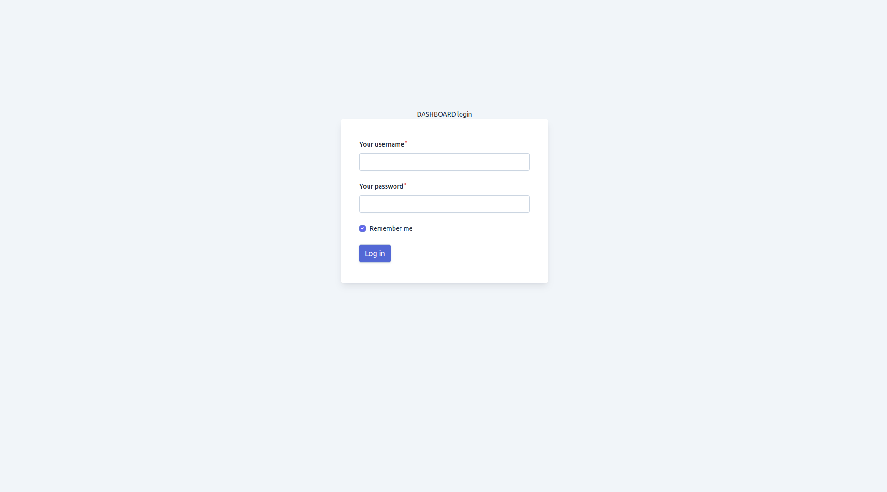
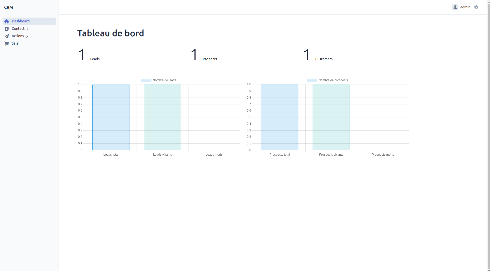
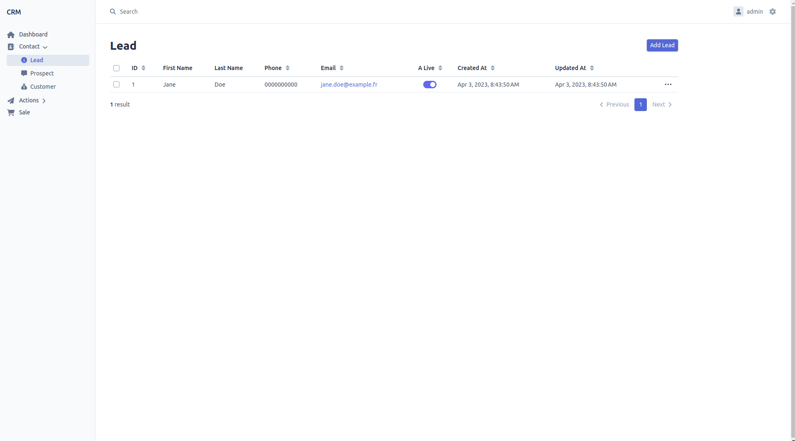

# CRM

Découvrez notre nouveau CRM ! Nous sommes ravis de vous présenter une solution simple et efficace pour gérer la relation client de votre entreprise. Conçu avec les fonctionnalités primaires uniquement, notre CRM est facile à prendre en main. Notre outil est conçu pour simplifier la gestion de la relation client, en vous permettant de mieux comprendre les besoins de vos clients et de les servir de manière plus efficace.

Notre CRM est basée sur [EasyAdmin 4](https://symfony.com/bundles/EasyAdminBundle/current/index.html), un bundle [Symfony](https://github.com/symfony/symfony).

## Login

Impossible d'accéder au reste du logiciel sans s'identifier. En un seul clic, vous pourrez vous connecter et accéder aux fonctionnalités principales du CRM.

L'accès est réservé à l'administrateur de l'application pour garantir la sécurité de vos données, préalablement inséré dans notre base postgres.

## Dashboard

Vous pouvez trouver un aperçu complet de toutes les informations importantes sur votre entreprise et vos clients, il affiche les statistiques clés de votre activité

Avec le dashboard, vous pouvez avoir une vue d'ensemble claire et en temps réel de votre entreprise.

## Contacts

Accédez facilement aux informations des différents Leads, Propects, et Customers.

Pouvoir facilement modifier ou ajouter un lead, prospect ou customer.

Pouvoir trier selon ce qu'on recherche, par exemple selon la date de création/modification, ou selon le type (mort/vivant).

### Table

Ces trois ressources on respectivement la même structure pour base.

| Champs         | Description                           |
|:---------------|:--------------------------------------|
| **Id**         | Identification de la ressource        |
| **firstname**  | Prénom du lead                        |
| **lastname**   | Nom de famille du lead                |
| **email**      | E-mail du lead                        |
| **phone**      | Portable/Téléphone du lead            |
| **a_live**     | Le contact est soit mort, soit vivant |
| **created_at** | Date de création de la ressource      |
| **updated_at** | Date de mise à jour de la ressource   |

### Lead
Le lead contient les informations de base d'un contact. Aucune action n'est possible avec un lead.

### Prospect
La distinction du propect par rapport au lead ce situe au niveau des actions. Il est possible d'ajouter des action à un prospect

### Customer

Un customer, ou client, reprends les principes de base d prospect. Cependant il est possible de conclure ou d'ajouter une vente un client, ce qui n'est pas le cas pour un prospect.

## Actions

### Tables

#### Action
| Champs             | Description                                |
|:-------------------|:-------------------------------------------|
| **Id**             | Identification de la ressource             |
| **action_type_id** | L'id du type d'action                      |
| **prospect_id**    | L'id du prospect (optionnel)               |
| **customer_id**    | L'id du customer (optionnel)               |
| **subject**        | L'object de l'action                       |
| **message**        | Le message/description de base de l'action |
| **created_at**     | Date de création de la ressource           |
| **updated_at**     | Date de mise à jour de la ressource        |

#### Note
| Champs           | Description                         |
|:-----------------|:------------------------------------|
| **Id**           | Identification de la ressource      |
| **note_type_id** | L'id du type de note                |
| **action_id**    | L'id de l'action                    |
| **message**      | Le message/description de la note   |
| **created_at**   | Date de création de la ressource    |
| **updated_at**   | Date de mise à jour de la ressource |

### Action type
#### Table
| Champs         | Description                                       |
|:---------------|:--------------------------------------------------|
| **Id**         | Identification de la ressource                    |
| **code**       | Code unique du type d'action                      |
| **name**       | Nom du type d'action (ex : email, téléphone, etc) |
| **created_at** | Date de création de la ressource                  |
| **updated_at** | Date de mise à jour de la ressource               |

### Note type
#### Table
| Champs         | Description                                      |
|:---------------|:-------------------------------------------------|
| **Id**         | Identification de la ressource                   |
| **code**       | Code unique du type de note                      |
| **name**       | Nom du type de note (ex : message, réponse, etc) |
| **created_at** | Date de création de la ressource                 |
| **updated_at** | Date de mise à jour de la ressource              |

## Sale

### Table
| Champs          | Description                         |
|:----------------|:------------------------------------|
| **Id**          | Identification de la ressource      |
| **customer_id** | L'id du customer                    |
| **name**        | Nom/Titre de la vente               |
| **description** | Description de la vente             |
| **price**       | Montant de la vente                 |
| **created_at**  | Date de création de la ressource    |
| **updated_at**  | Date de mise à jour de la ressource |
